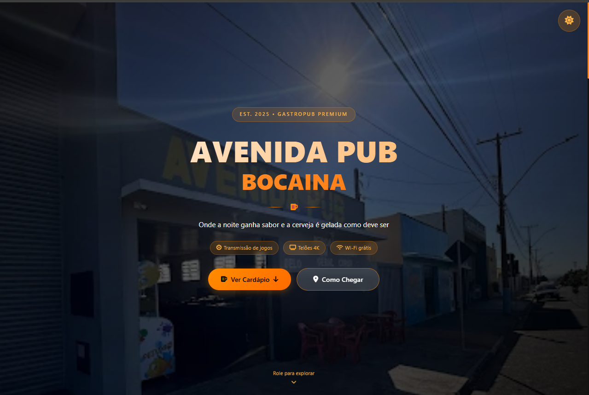

<div align="center">

# 🍻 Avenida Pub Bocaina

### Cardápio digital responsivo desenvolvido para um estabelecimento real

<br>


<br><br>

<a href="https://lipeprieto.github.io/cardapio-avenida-pub/">
  
</a>

<a href="https://github.com/LipePrieto/cardapio-avenida-pub">
  
</a>

<br><br>



</div>

---

## 📖 Sobre o projeto

O **Avenida Pub Bocaina** é um site institucional com cardápio digital desenvolvido para apresentar as bebidas, preços, localização e informações de um estabelecimento real localizado em Bocaina, São Paulo.

O projeto foi criado com foco em uma experiência simples e moderna, permitindo que o cliente consulte o cardápio diretamente pelo celular, computador ou por meio de um QR Code.

Além do cardápio, o site também apresenta informações sobre o ambiente, formas de pagamento, horário de funcionamento, Instagram e localização do estabelecimento.

---

## 🌐 Acesse o projeto

O site está publicado gratuitamente utilizando o GitHub Pages:

### [🍻 Abrir Cardápio Avenida Pub](https://lipeprieto.github.io/cardapio-avenida-pub/)

---

## ✨ Funcionalidades

- Cardápio digital com imagens, nomes e preços
- Produtos gerados dinamicamente com JavaScript
- Pesquisa de cervejas em tempo real
- Contador de resultados encontrados
- Alternância entre tema escuro e tema claro
- Preferência de tema salva no navegador
- Tela de carregamento com skeleton
- Layout totalmente responsivo
- Animações durante a rolagem da página
- Navegação suave entre as seções
- Botão para voltar ao topo
- Informações sobre o estabelecimento
- Horário de funcionamento
- Formas de pagamento aceitas
- Integração com Google Maps
- Link direto para o Instagram
- Destaque para as bebidas mais pedidas
- Informações sobre transmissão de jogos e sinuca

---

## 🛠️ Tecnologias utilizadas

| Tecnologia | Utilização |
|---|---|
| HTML5 | Estrutura e conteúdo da página |
| CSS3 | Layout, responsividade, temas e animações |
| JavaScript | Cardápio dinâmico, busca, temas e interações |
| Font Awesome | Ícones utilizados na interface |
| Google Fonts | Tipografia do projeto |
| Git e GitHub | Versionamento e armazenamento do código |
| GitHub Pages | Publicação gratuita do site |

---

## 📱 Responsividade

O projeto foi desenvolvido para funcionar em diferentes tamanhos de tela:

- Computadores
- Notebooks
- Tablets
- Celulares

A interface se adapta automaticamente para facilitar a visualização do cardápio e das informações do estabelecimento.

---

## 🔍 Pesquisa de produtos

O site possui uma pesquisa em tempo real.

Ao digitar o nome de uma cerveja, os produtos são filtrados automaticamente e a quantidade de resultados é atualizada na tela.

Exemplos:

```text
Heineken
Corona
Brahma
Stella Artois
```

Caso nenhum produto seja encontrado, o site informa ao usuário que não há resultados disponíveis.

---

## 🌗 Tema claro e escuro

O usuário pode alternar entre:

```text
☀️ Tema claro
🌙 Tema escuro
```

A preferência escolhida fica salva no navegador utilizando `localStorage`, fazendo com que o tema continue selecionado mesmo depois que a página for fechada.

---

## 🍺 Como atualizar o cardápio

Os produtos estão cadastrados dentro do arquivo:

```text
script.js
```

Cada bebida segue uma estrutura semelhante a esta:

```javascript
{
    name: "Heineken",
    price: 14,
    style: "Lager Premium",
    top: false,
    image: "images/heineken.png"
}
```

### Propriedades

| Propriedade | Descrição |
|---|---|
| `name` | Nome da bebida |
| `price` | Preço do produto |
| `style` | Descrição ou estilo da bebida |
| `top` | Define se o produto recebe o selo “Mais Pedida” |
| `image` | Caminho da imagem do produto |

Para alterar um preço, basta modificar o valor da propriedade:

```javascript
price: 14
```

Para destacar uma bebida como mais pedida:

```javascript
top: true
```

---

## ⚙️ Como executar o projeto

### 1. Clone o repositório

```bash
git clone https://github.com/LipePrieto/cardapio-avenida-pub.git
```

### 2. Entre na pasta

```bash
cd cardapio-avenida-pub
```

### 3. Abra o projeto

Abra o arquivo:

```text
index.html
```

Também é possível utilizar uma extensão como **Live Server** no Visual Studio Code.

---

## 📂 Estrutura principal

```text
cardapio-avenida-pub/
├── images/
│   ├── brahma.png
│   ├── boa.png
│   ├── heineken.png
│   ├── corona.png
│   └── outras imagens
│
├── index.html
├── style.css
├── script.js
├── preview.png
└── README.md
```

---

## 🚀 Publicação

O projeto está hospedado pelo GitHub Pages diretamente a partir da branch principal:

```text
main
```

Link publicado:

```text
https://lipeprieto.github.io/cardapio-avenida-pub/
```

Quando uma alteração é enviada para a branch `main`, o GitHub Pages atualiza o site automaticamente.

---

## 📚 Aprendizados

Durante o desenvolvimento deste projeto, pratiquei:

- Estruturação semântica com HTML
- Criação de layouts responsivos com CSS
- Manipulação do DOM com JavaScript
- Criação dinâmica de elementos
- Uso de arrays e objetos
- Filtro e pesquisa em tempo real
- Armazenamento de preferências com localStorage
- Intersection Observer para animações
- Integração com serviços externos
- Organização de arquivos e imagens
- Publicação de sites com GitHub Pages
- Desenvolvimento voltado a uma necessidade real

---

## 🔮 Possíveis melhorias futuras

- Botão para realizar pedidos pelo WhatsApp
- Categorias de bebidas e alimentos
- Filtro por preço
- Painel para atualização do cardápio
- Integração com banco de dados
- Cadastro de promoções
- Área de eventos e jogos transmitidos
- Sistema de produtos indisponíveis
- QR Code personalizado para acesso ao cardápio

---

## 🎯 Objetivo do projeto

Este projeto demonstra minha capacidade de transformar uma necessidade real em uma solução digital funcional.

Mais do que criar apenas uma página visual, o objetivo foi desenvolver uma ferramenta que pudesse ajudar um estabelecimento a:

- Apresentar seus produtos
- Divulgar preços
- Facilitar o acesso ao cardápio
- Informar localização e horário
- Fortalecer sua presença digital
- Melhorar a experiência dos clientes

---

## 👨‍💻 Autor

Desenvolvido por **Luis Felipe Prieto**.

<div align="center">

<a href="https://github.com/LipePrieto">
  
</a>

<a href="https://www.linkedin.com/in/luisfelipeprieto1/">
  
</a>

</div>

---

<div align="center">

### 🍻 Avenida Pub Bocaina

**Onde a noite ganha sabor e a cerveja é gelada como deve ser.**

<br>

<a href="https://lipeprieto.github.io/cardapio-avenida-pub/">
  
</a>

</div>
